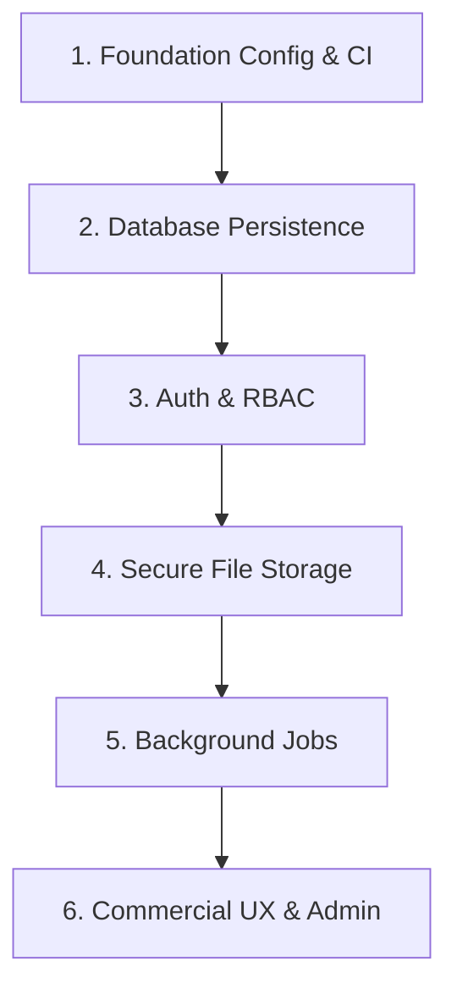

# FinSight CFO Production & Commercialization Roadmap

This document outlines the architecture gap analysis and migration sequence required to graduate the FinSight CFO platform from its current MVP state to an enterprise-grade, commercial SaaS or bank-production environment.

---

## 1. Current Status

The current implementation is a **challenge-ready MVP** designed for demonstrating the end-to-end CFO intelligence workflows (Financial Health, Valuation, Credit Readiness, Funding Strategy, and Advisory Blueprinting). 
- It uses localized file storage (`backend/storage_db/`) for state and file uploads.
- It is optimized for single-user local developer or demo setups.
- It is **not** currently suitable for bank-production deployments or multi-tenant commercial SaaS usage.

---

## 2. Commercial-Ready Target

To support commercial-scale SaaS or bank deployments, the system must evolve to support:

- **Production Authentication**: Integration with OpenID Connect (OIDC), OAuth2, or SAML (e.g., Auth0, Keycloak, or Okta).
- **Tenant Isolation**: Strict logical or physical data isolation to ensure that one client cannot access another client's financial records.
- **Role-Based Access Control (RBAC)**: Fine-grained permissions (e.g., CFO, Auditor, Analyst, Read-Only Observer).
- **Database Persistence**: Migration from local JSON files to a managed relational database cluster (e.g., Amazon RDS PostgreSQL or Google Cloud SQL) with migration tracking (Alembic).
- **Object Storage**: Storage of uploaded financial documents in secure object stores (e.g., AWS S3, Google Cloud Storage) with encryption at rest.
- **Secure Upload Pipeline**: Malware scanning (e.g., ClamAV) and sandboxed file parsers to handle PDFs/Excel sheets securely.
- **Background Jobs**: Offloading heavy analysis, PDF rendering, or batch operations to asynchronous worker pools (e.g., Celery with Redis or RabbitMQ broker).
- **Audit & Compliance Controls**: Read-only, cryptographic audit logs tracking all access to sensitive company financials.
- **Observability**: Structured application logging, metrics collection (Prometheus/Grafana), and APM tracing (OpenTelemetry).
- **Automated CI/CD**: Fully automated delivery pipelines targeting staging and production environments under strict gates.

---

## 3. Recommended Migration Sequence

### Step 1: Foundation Config & CI (Current State)
- Implement environment-driven settings (CORS, mode selectors) and add config assertions at startup.
- Establish clean linting, compilation, and automated test pipelines in GitHub Actions.

### Step 2: Database Persistence
- Replace the workspace file-store repository with a relational database repository.
- Design database schemas for `CompanyWorkspace`, `UploadedFileRecord`, and `AnalysisRun`.
- Introduce Alembic for database migration tracking.
- Author planning documentation for cutover safety:
  - [Runtime Database Cutover Plan](file:///d:/projects/finsight-cfo-v3/docs/engineering/RUNTIME_CUTOVER_PLAN.md)
  - [Database Runtime Test Matrix](file:///d:/projects/finsight-cfo-v3/docs/engineering/DB_RUNTIME_TEST_MATRIX.md)
  - [Rollback Plan](file:///d:/projects/finsight-cfo-v3/docs/engineering/ROLLBACK_PLAN.md)
- Detailed specifications are available in the design docs:
  - [DB Persistence Design](file:///d:/projects/finsight-cfo-v3/docs/engineering/DB_PERSISTENCE_DESIGN.md)
  - [DB Schema Proposal](file:///d:/projects/finsight-cfo-v3/docs/engineering/DB_SCHEMA_PROPOSAL.md)
  - [Local-to-DB Migration Plan](file:///d:/projects/finsight-cfo-v3/docs/engineering/MIGRATION_PLAN_LOCAL_TO_DB.md)

### Step 3: Auth & RBAC
- Add authentication middleware to validate JWTs.
- Implement token-based endpoint access control.
- Enforce strict Workspace level ownership checks (user-to-workspace mapping).

### Step 4: Secure File Storage
- Replace local storage for PDF/Excel uploads with a cloud object storage client.
- Secure URLs utilizing pre-signed links with short expiration windows.
- Integrate virus-scanning containers into the file-upload endpoint.

### Step 5: Background Jobs
- Set up Celery/Redis tasks for long-running workflows like `execute_workflow_run()`.
- Add task polling or WebSockets to the API for real-time analysis status updates.

### Step 6: Commercial UX & Admin
- Implement tenant onboarding flows.
- Create administrator portals for billing, usage monitoring, and platform controls.

---

## 4. Known Current Limitations

- **Local JSON / File Storage**: All data rooms, workspace properties, and analysis runs are stored as raw JSON files in `backend/storage_db/`.
- **Guarded Sample Helper**: The sample workspace initialization relies on local file templates and a development utility to reset data. This utility is disabled by default in production mode.
- **No Production Auth/RBAC**: The backend routes currently assume a single tenant workspace context without validating active corporate identity.
- **No Real Bank/Credit Bureau Integrations**: Financial statements are uploaded manually; live integration feeds (e.g., Plaid, Open Banking, or bureau APIs) are not present.
- **No Multi-Worker Storage Support**: Because storage is local, running the API behind a multi-worker ASGI server (like Gunicorn/Uvicorn workers) or in a Kubernetes cluster with multiple pods will cause split-brain state inconsistencies.
