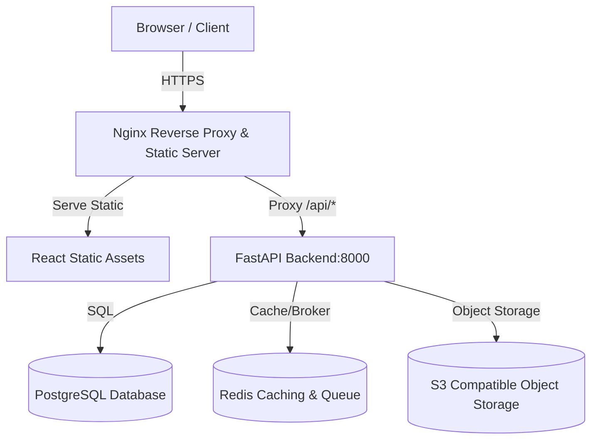

# FinSight CFO: Web Deployment Runbook

This runbook outlines how to configure, secure, deploy, and verify FinSight CFO in a public web or production environment with a PostgreSQL database and S3-compatible object storage.

---

## 1. Production Architecture Overview

FinSight CFO is structured as a two-tier application:
1. **Frontend**: A React SPA built using Vite. In production, this is compiled to static HTML/JS/CSS assets and served by Nginx.
2. **Backend**: A FastAPI REST API service. In production, this runs on Uvicorn/Gunicorn.



---

## 2. Database Provisioning & Schema Setup

For production web deployments, FinSight CFO switches from its default in-memory/JSON-file persistence mode to a relational database backend.

### Required Environment Variables
Set the following environment variables in your deployment environment:
```bash
# Set persistence mode to relational database
PERSISTENCE_BACKEND="database"

# Database URL pointing to a hosted PostgreSQL instance (SQLAlchemy format)
DATABASE_URL="postgresql+psycopg2://<db_user>:<db_password>@<db_host>:<db_port>/<db_name>"

# Toggle database SQL logging (Keep false in production to optimize performance)
DATABASE_ECHO=false
```

### Running Schema Migrations (Alembic)
Schema migrations must be run automatically during container startup or deployment pipelines.
Run the following command from the `backend/` directory to upgrade the database schema to the latest version:
```bash
cd backend
python -m alembic upgrade head
```

Or, in a Docker environment:
```dockerfile
ENTRYPOINT ["sh", "-c", "alembic upgrade head && uvicorn app.main:app --host 0.0.0.0 --port 8000"]
```

---

## 3. Object Storage Configuration (S3 / MinIO)

FinSight CFO supports S3-compatible object storage for storing physical file uploads (data room spreadsheets, PDFs, etc.). If any S3 environment variables are missing, the application falls back safely to writing files to the local file system.

### S3 Settings
```bash
# S3 access credentials
S3_ACCESS_KEY_ID="minio_access_key"
S3_SECRET_ACCESS_KEY="minio_secret_key"

# Target bucket name (Canonical: S3_BUCKET; Fallback: S3_BUCKET_NAME)
S3_BUCKET="finsight-cfo-assets"

# The endpoint URL for S3 (Leave empty for standard AWS S3, or set for MinIO/LocalStack)
S3_ENDPOINT_URL="http://minio:9000"

# S3 Region configuration (Canonical: S3_REGION; Fallback: S3_REGION_NAME)
S3_REGION="us-east-1"

# Force SSL / HTTPS for S3 connections
S3_SECURE=true
```

---

## 4. Environment Variables Checklist

Create a `.env.production` file (using `.env.production.example` as a template) or inject these variables into your hosting platform:

| Variable Name | Description | Example / Recommended Value |
| :--- | :--- | :--- |
| `APP_MODE` | Must be set to `production` to trigger security rules. | `production` |
| `ALLOW_DEMO_FALLBACK` | Disable local fallback mock data endpoints in production. | `false` |
| `MARKET_WATCH_USE_FIXTURES` | Forces real upstream APIs rather than local data fixtures. | `false` |
| `CORS_ALLOW_ORIGINS` | Comma-separated list of allowed production domains. **Must not contain only localhost/127.0.0.1**. | `https://app.yourcompany.com` |
| `PERSISTENCE_BACKEND` | Switch storage driver to database mode. | `database` |
| `DATABASE_URL` | Connection string to your production database. | `postgresql://db_user:pwd@db_host:5432/db_name` |
| `AUTH_MODE` | Authentication provider mode. | `production` |
| `JWT_SECRET_KEY` | Canonical 32+ character random string for signing JWT tokens. | `a_very_long_secure_random_key_here` |
| `AUTH_SECRET` | Deprecated fallback 32+ character random string. | `a_very_long_secure_random_key_here` |
| `QUEUE_BACKEND` | Enable Redis as the background task broker. | `redis` |
| `QUEUE_REDIS_URL` | Canonical Redis server connection URI. | `redis://:password@redis-host:6379/0` |
| `REDIS_URL` | Deprecated Redis connection URI fallback. | `redis://:password@redis-host:6379/0` |
| `VITE_API_BASE_URL` | Frontend API base endpoint. Leave empty/blank if using Nginx same-origin proxying. | ` ` (blank) |

---

## 5. Production Config Guardrails

The application runs strict checks upon boot under `APP_MODE=production`:
- **CORS Lock**: The app will fail to start if allowed origins only include localhost domains.
- **Demo Mode Lock**: Startup fails if `ALLOW_DEMO_FALLBACK` or `MARKET_WATCH_USE_FIXTURES` are true in production mode.
- **Auth Key Lock**: Startup fails if both `JWT_SECRET_KEY` and `AUTH_SECRET` are missing or blank.
- **DB Connection Lock**: Startup fails if `PERSISTENCE_BACKEND=database` but `DATABASE_URL` is not provided.

---

## 6. Deployment Options

### Option A: Single VM / VPS (Docker Compose)
The easiest way to run the entire stack on a single Virtual Private Server (Ubuntu/Debian) is using Docker Compose.
1. **Setup Env**: Copy `.env.production.example` to `.env.production` and fill in the secrets.
2. **Run Services**:
   ```bash
   docker compose -f docker-compose.production.yml up -d --build
   ```
3. **Proxy / SSL**: Set up Certbot (Let's Encrypt) on the host machine to wrap Nginx (port 80) with SSL (port 443).

### Option B: Managed PaaS (Render, Railway, Fly.io)
1. **Backend Service**:
   - Build Command: `pip install -r backend/requirements.txt`
   - Start Command: `PYTHONPATH=backend uvicorn backend.app.main:app --host 0.0.0.0 --port $PORT`
   - Health Check Path: `/health`
   - Readiness Probe Path: `/ready` (performs database and Redis connection verification)
2. **Managed Database & Cache**:
   - Provision Managed PostgreSQL and Redis instances. Map connections to `DATABASE_URL` and `QUEUE_REDIS_URL` respectively.

---

## 7. Security Best Practices

### SSL/TLS
Always serve the application over HTTPS. Ensure the Nginx configuration or cloud load balancer terminates SSL.

### Security Headers
The provided `nginx.conf` injects the following headers to safeguard the application:
- `X-Content-Type-Options: nosniff` (prevents MIME type sniffing)
- `Referrer-Policy: strict-origin-when-cross-origin` (controls referrer leakage)
- `X-Frame-Options: DENY` (mitigates clickjacking attacks)
- `Content-Security-Policy`: Restricts scripts, styles, connections, and images to trusted origins.

---

## 8. Verification and Health Checks

### Local Verification Mode
If `PERSISTENCE_BACKEND` is set to `"local"` or left unset, FinSight CFO stores all state under local JSON configurations in the `storage_db` directory. This is optimal for developer environments and does not require starting PostgreSQL or S3.

### Startup Verification
Ensure the service starts correctly and the `/health` check endpoint returns `200 OK`:
```bash
curl -f http://localhost:8000/health
```

### Running the Test Suite
Validate the persistence modes by running the test suite:
```bash
# Run tests under database configuration
$env:PERSISTENCE_BACKEND="database"
$env:DATABASE_URL="sqlite:///./storage_db/finsight_test.db"
$env:PYTHONPATH="."
python -m pytest tests
```

---

## 9. Data Providers & Source Provenance

This section documents the configuration, deployment, and validation steps for the Market Watch data providers, credentials, and source provenance settings.

### Environment Configurations
Configure the following environment variables on the production host or within Docker `.env` files to control data provider adapter behaviors:

#### A. Public / Scraping Feeds (Auto-failover)
- `HKAB_ENABLED` (default: `true`): Enable primary HKAB HIBOR scraping.
- `HKMA_ENABLED` (default: `true`): Enable secondary HKMA API for GBA HIBOR fallback and HONIA/Liquidity indicators.
- `FRANKFURTER_ENABLED` (default: `true`): Enable Frankfurter API for GBA trade currency pair rate tracking.

#### B. Paid / Credential-Backed Feeds (Honesty-Hardened)
If these keys are missing or invalid, the backend dynamically resolves the provider status as `provider_not_configured`, returning descriptive warnings/hints to the frontend instead of silently presenting sandbox data as live:
- `ALPHA_VANTAGE_API_KEY`: API credential for Commodities tracking.
- `CHINADATA_API_KEY` / `IHS_API_KEY`: API credential for Sector Benchmarks and industrial metrics.
- `CME_FEDWATCH_API_KEY`: API credential for timing and monetary policy indicators.

### Lender Product Catalog Setup
FinSight CFO resolves lender products and indicative rates via a config-driven JSON catalog.
- Set `LENDER_CATALOG_PATH` in the backend environment to point to the directory containing `provider_catalog.json`.
- A sample template is provided at: `demo_data/provider_catalog.sample.json`.
- For production, copy this to a secure volume, edit the indicative pricing terms, and update the environment variable:
  ```bash
  LENDER_CATALOG_PATH=/var/lib/finsight/provider_catalog.json
  ```

### Post-Deployment Verification
1. Verify backend status endpoints return correct provenance mode mappings:
   ```bash
   curl -X GET http://localhost:8000/api/market-watch/sources
   ```
2. Verify that missing keys cause the endpoints to report `provider_not_configured` honestly:
   - Check response fields in `/api/market-watch/commodities` for `provenance.source_mode == "provider_not_configured"`.
