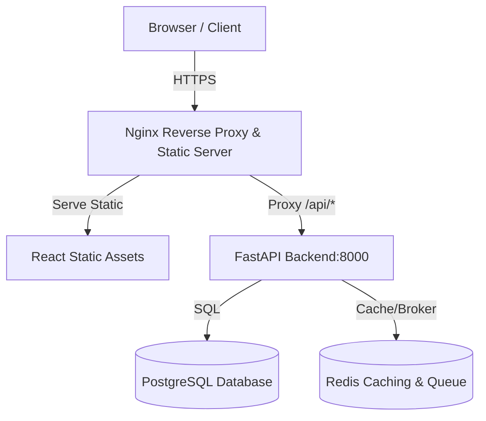

# FinSight CFO: Web Deployment Runbook

This runbook outlines how to configure, secure, and deploy FinSight CFO in a public web/production environment.

---

## 1. Production Architecture Overview

FinSight CFO is structured as a two-tier application:
1. **Frontend**: A React SPA built using Vite. In production, this is compiled to static HTML/JS/CSS assets and served by Nginx.
2. **Backend**: A FastAPI REST API service. In production, this runs on Uvicorn behind a reverse proxy (Nginx).



---

## 2. Environment Variables Checklist

Create a `.env.production` file (using `.env.production.example` as a template) or inject these variables into your hosting platform:

| Variable Name | Description | Example / Recommended Value |
| :--- | :--- | :--- |
| `APP_MODE` | Must be set to `production` to trigger security rules. | `production` |
| `ALLOW_DEMO_FALLBACK` | Disable local fallback mock data endpoints in production. | `false` |
| `MARKET_WATCH_USE_FIXTURES` | Forces real upstream APIs rather than local data fixtures. | `false` |
| `CORS_ALLOW_ORIGINS` | Comma-separated list of allowed production domains. **Must not contain only localhost/127.0.0.1**. | `https://app.yourcompany.com` |
| `PERSISTENCE_BACKEND` | Switch storage driver to database mode. | `database` |
| `DATABASE_URL` | Connection string to your production database. | `postgresql://db_user:pwd@db_host:5432/db_name` |
| `AUTH_MODE` | Authentication provider mode. | `production` |
| `AUTH_SECRET` | 32+ character random string for signing JWT tokens / auth context. | `a_very_long_secure_random_key_here` |
| `QUEUE_BACKEND` | Enable Redis as the background task broker. | `redis` |
| `REDIS_URL` | Redis server connection URI. | `redis://:password@redis-host:6379/0` |
| `VITE_API_BASE_URL` | Frontend API base endpoint. Leave empty/blank if using Nginx same-origin proxying. | ` ` (blank) |

---

## 3. Production Config Guardrails

The application runs strict checks upon boot under `APP_MODE=production`:
- **CORS Lock**: The app will fail to start if allowed origins only include localhost domains (e.g., `localhost` or `127.0.0.1`).
- **Demo Mode Lock**: Startup fails if `ALLOW_DEMO_FALLBACK` or `MARKET_WATCH_USE_FIXTURES` are true in production mode.
- **Auth Key Lock**: Startup fails if `AUTH_SECRET` is missing or blank.
- **DB Connection Lock**: Startup fails if `PERSISTENCE_BACKEND=database` but `DATABASE_URL` is not provided.

---

## 4. Deployment Options

### Option A: Single VM / VPS (Docker Compose)
The easiest way to run the entire stack on a single Virtual Private Server (Ubuntu/Debian) is using Docker Compose.

1. **Prerequisites**: Ensure Docker and Docker Compose (V2) are installed.
2. **Setup Env**: Copy `.env.production.example` to `.env.production` and fill in the secrets.
3. **Run Services**:
   ```bash
   docker compose -f docker-compose.production.yml up -d --build
   ```
4. **Proxy / SSL**: Set up Certbot (Let's Encrypt) on the host machine to wrap Nginx (port 80) with SSL (port 443).

### Option B: Managed PaaS (Render, Railway, Fly.io)
For fully-managed, serverless container hosting:

#### 1. Backend Service
- **Type**: Web Service / Private Service
- **Build Command**: `pip install -r backend/requirements.txt`
- **Start Command**: `PYTHONPATH=backend uvicorn backend.app.main:app --host 0.0.0.0 --port $PORT`
- **Environment**: Add all production environment variables to the dashboard.
- **Health Check Path**: `/health` (lightweight)
- **Readiness Probe Path**: `/ready` (performs database and Redis connection verification)

#### 2. Managed Database & Cache
- Provision a Managed PostgreSQL database on the platform. Copy the connection string to `DATABASE_URL`.
- Provision a Managed Redis cluster. Copy the connection string to `REDIS_URL`.

### Option C: Decoupled (Vercel Frontend + Hosted Backend)
If you want to host the frontend on Vercel/Netlify for global CDN caching:

1. **Deploy Frontend on Vercel**:
   - Framework preset: `Vite`
   - Build command: `npm run build`
   - Output directory: `dist`
   - Environment variables: Set `VITE_API_BASE_URL` to your public hosted backend URL (e.g., `https://api.yourcompany.com`).
2. **Deploy Backend**:
   - Set up the backend on Render, AWS ECS, or Fly.io.
   - Configure `CORS_ALLOW_ORIGINS` to contain your Vercel URL (e.g., `https://your-app.vercel.app`).

---

## 5. Security Best Practices

### SSL/TLS
Always serve the application over HTTPS. Ensure the Nginx configuration or cloud load balancer terminates SSL.

### Security Headers
The provided `nginx.conf` injects the following headers to safeguard the application:
- `X-Content-Type-Options: nosniff` (prevents MIME type sniffing)
- `Referrer-Policy: strict-origin-when-cross-origin` (controls referrer leakage)
- `X-Frame-Options: DENY` (mitigates clickjacking attacks)
- `Content-Security-Policy`: Restricts scripts, styles, connections, and images to trusted origins.

---

## 6. Database Migrations

When `PERSISTENCE_BACKEND=database` is active, the PostgreSQL schema must be prepared.

To run database migrations:
1. Ensure your database is running and accessible.
2. From the `backend` directory, run:
   ```bash
   alembic upgrade head
   ```
   *In Docker Compose setups, this can be added to the backend container startup command or executed via:*
   ```bash
   docker compose -f docker-compose.production.yml exec backend alembic upgrade head
   ```
