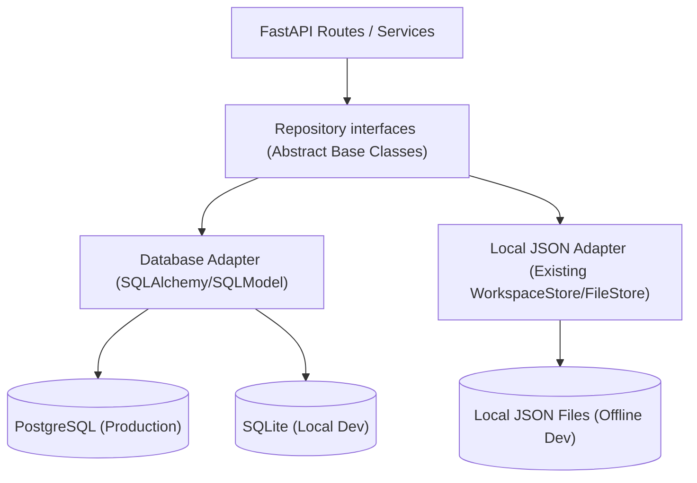
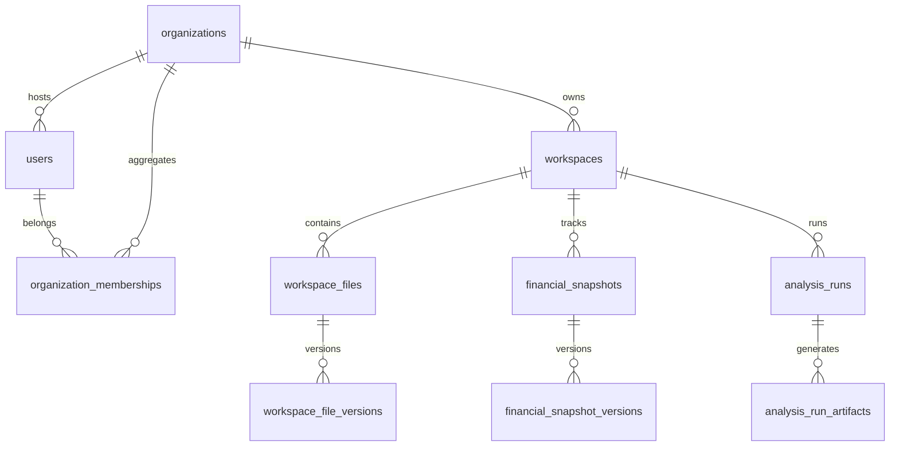

# Database Persistence Layer Design

## 1. Executive Summary
This document outlines the architectural design for migrating FinSight CFO from its local JSON/file-based persistence layer to an enterprise-grade database persistence layer. The migration will lay the foundation for a secure, multi-tenant commercial SaaS deployment while maintaining compatibility with local developer and offline demonstration modes.

---

## 2. Current Persistence Limitations
The current "challenge-ready MVP" relies on a local file store (under `backend/storage_db/`) that saves workspaces and metadata as raw JSON files. This approach exhibits several critical bottlenecks:
- **No Concurrency Guardrails**: Concurrent file writes can result in race conditions and data corruption since there is no row-level locking or transaction support.
- **Pod/Server Scaling Inability**: In a multi-worker ASGI environment (e.g., Uvicorn workers) or containerized clusters (e.g., Kubernetes), localized disk persistence leads to split-brain inconsistencies between processes.
- **Lack of Tenant Boundaries**: Data boundaries are handled implicitly by file paths rather than isolated relational records linked to authenticated user organizations.
- **Difficult Querying and Reporting**: Generating aggregated metrics, audit trails, and historical statistics requires reading and parsing multiple JSON files on disk, causing heavy I/O overhead.

---

## 3. Target Architecture
The long-term commercial target transitions the application to a cloud-managed PostgreSQL cluster. In local development or demo modes, a SQLite adapter can be configured to avoid forcing a full PostgreSQL dependency on developers.



---

## 4. Repository Pattern Proposal
To isolate the business logic from persistence technologies, we will define abstract repository classes (interfaces) using Python's `abc` module. The core services will import and interact only with these abstract interfaces.

```python
from abc import ABC, abstractmethod
from typing import Optional, list
from app.models.workspace import CompanyWorkspace, AnalysisRun

class WorkspaceRepository(ABC):
    @abstractmethod
    def get_by_id(self, workspace_id: str, org_id: str) -> Optional[CompanyWorkspace]:
        pass

    @abstractmethod
    def save(self, workspace: CompanyWorkspace, org_id: str) -> CompanyWorkspace:
        pass

    @abstractmethod
    def list_by_org(self, org_id: str) -> list[CompanyWorkspace]:
        pass
```

---

## 5. Tenant Isolation Model
Multi-tenancy will be enforced logical-level isolation using an `organization_id` column as a tenant identifier on all tenant-owned entities.
- **Tenant Scope Enforcement**: Every database query on workspace-scoped entities **must** include `org_id` in the `WHERE` clause (e.g., `SELECT * FROM workspaces WHERE id = :id AND org_id = :org_id`).
- **Context Propagation**: We will implement a dependency-injected request context or middleware that extracts `organization_id` from the authenticated user context and propagates it down to the repository layer.
- **Row-Level Security (RLS)**: For production PostgreSQL deployments, we recommend enabling PostgreSQL Row-Level Security (RLS) policies as a secondary defense layer to block cross-tenant queries at the connection level.

---

## 6. Data Ownership Model



- **Organization**: The primary billing and data boundary.
- **User**: Authenticated entities belonging to one or more organizations.
- **Workspace**: Always owned by exactly one Organization. All snapshots, files, and analysis runs belong to a workspace.

---

## 7. Write Path Examples

### File Upload and Ingestion Path
1. **API Endpoint**: `POST /api/workspaces/{workspace_id}/files/upload` receives file bytes.
2. **Security**: Validate that the user belongs to the organization that owns the target workspace.
3. **Write Metadata**: Call `FileRepository.create_file_record(filename, workspace_id, org_id)` which registers metadata in the database and returns a record.
4. **Physical Write**: Write the raw bytes to the object store (e.g. S3) using the generated file version ID as the key.
5. **Audit Event**: Call `AuditRepository.log_event("file_upload", user_id, org_id)`.

---

## 8. Read Path Examples

### Executing Financial Projection
1. **API Endpoint**: `GET /api/financials/{workspace_id}/projections` request.
2. **Context**: Extract `org_id` from user credentials.
3. **Read Snapshot**: Fetch active `financial_snapshots` record for the given workspace:
   `SELECT * FROM financial_snapshots WHERE workspace_id = :ws_id AND org_id = :org_id AND is_active = TRUE`
4. **Logic Execution**: Feed the snapshot JSON data into the in-memory financial calculator.
5. **Respond**: Return formatted projections response.

---

## 9. Compatibility Strategy with Existing WorkspaceStore/FileStore
To support seamless development:
- **Feature Flag Selector**: Introduce `PERSISTENCE_BACKEND` env variable supporting `local` or `database`.
- **Abstract Unified Factory**: Instantiate the appropriate repository implementation at startup depending on the flag.
- **No Contract Modifications**: Both the local JSON adapter and the DB-based adapter must return models that map directly to the existing pydantic schemas (`CompanyWorkspace`, `AnalysisRun`, etc.).

---

## 10. Risks and Mitigations

- **Risk 1: Split-Brain Dual Write Inconsistencies during Cutover**
  * *Mitigation*: Perform a one-time migration. During cutover, put the local JSON storage in read-only mode, extract all data, ingest it into the DB, and immediately toggle the flag to DB-only writes.
- **Risk 2: Heavy JSON Schema Evolution on Financial Snapshots**
  * *Mitigation*: Keep snapshots in a relational `JSONB` column to preserve schema flexibility while enforcing core indexes on workspace keys.
- **Risk 3: Dev Environment Overhead**
  * *Mitigation*: Ensure the repository engine supports SQLite seamlessly for local builds, matching PostgreSQL's dialect capabilities.

---

## 11. Implementation Sequence Split into PRs

- **PR #1**: Define abstract repository interfaces and add Pydantic model configurations.
- **PR #2**: Set up Alembic, SQLAlchemy models, and establish initial SQLite/PostgreSQL schemas.
- **PR #3**: Implement `WorkspaceRepository` DB adapter and add dual-mode selector config.
- **PR #4**: Implement `FileRepository` and `AnalysisRunRepository` DB adapters.
- **PR #5**: Implement audit events, background job status, and report run histories.
- **PR #6**: Cutover data migration script and disable local JSON writes in production environments.

---

## 12. Definition of Done for the Database Foundation
- All abstract repository interfaces have 100% test coverage with mock implementations.
- Database migrations execute cleanly via Alembic on both SQLite and PostgreSQL.
- The dual-mode configuration flag allows running the full test suite against both the local file store and the SQLite repository.
- 0 product endpoints alter their response contracts.
